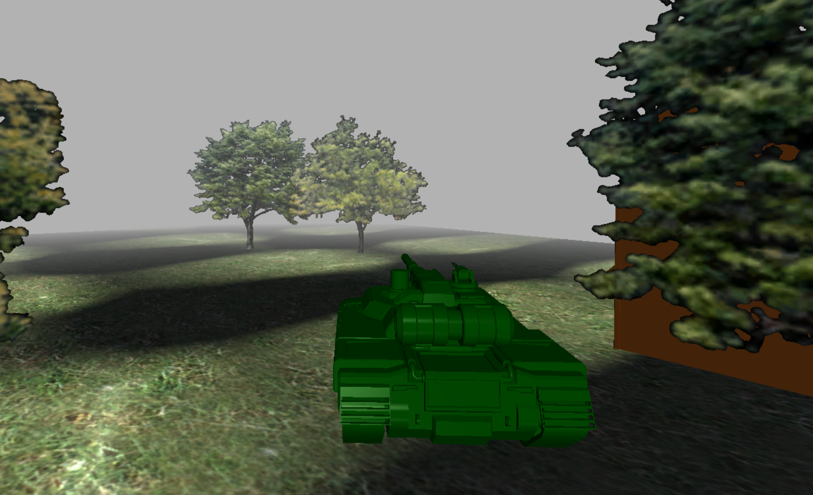

# Tank Game
This is a 1vs1 tank game developed in a group of eight using C++, C#, OpenCL, and WPF. The game features a multiplayer mode where two players can compete against each other in a battle arena. Players control tanks and use them to shoot at each other.

# Installation
To install the game, you will need to clone the repository to your local machine and build it using Visual Studio or another IDE that supports C++ and C#. You will also need to have OpenCL installed on your machine to run the game.

# Usage
To start the game, simply run the executable file. You will be taken to the game's main menu, where you can join other players through tankserv DLL.

The game controls are simple. Use the arrow keys to move your tank, and use the spacebar to shoot. You have 1 health.

# Technologies Used
- C++: Used to develop the game's core functionality and game engine.
- C#: Used to develop the game's user interface (UI) and user experience (UX) using WPF.
- OpenCL: Used to implement spatial audio and enhance the game's graphics.
- WPF: Used to create the game's UI, including menus, buttons, and other graphical elements.

# Credits
This game was developed by a team of eight individuals, including myself. Our team worked together to create a fun and engaging gaming experience.

